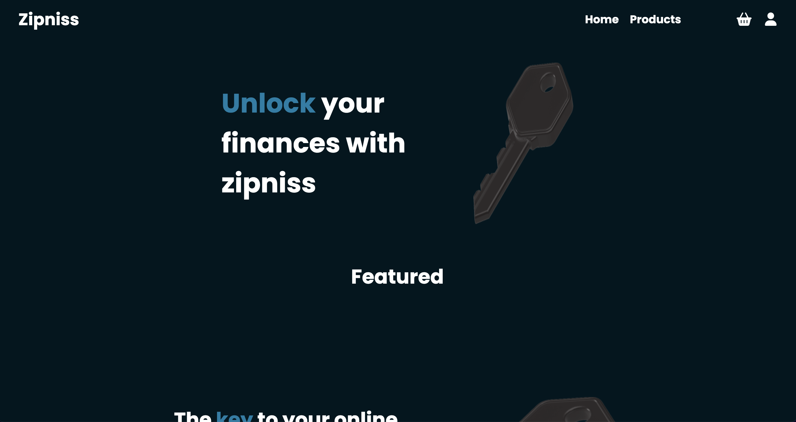

# Semester project 2



An Ecommerce website with customer and admin sections run with strapi api. 

## Description

The website includes customer-facing sections as well as admin, it has login authentication for admins for when they
want to update products/images on the website, The admin section contains tools such as deleting products, adding products,
editing products, adding products as featured. It uses strapi api for all things from login authentication to api calls.
You can add some bullet points if you'd like to:

- strapi
- admin section
- Login authentication

## Built With

- [Sass](https://sass-lang.com/)
- [javascript](https://www.javascript.com/)

## Getting Started

### Installing

This is where you list how to get the project started. It typically just includes telling a person to clone the repo and then to install the dependencies e.g.

1. Clone the repo:

```bash
git clone git@github.com:NoroffFEU/portfolio-1-example.git
```

### Running

To run the app, run the following commands:

Project is stricly html and javascript just running a local server will work to start the website.

## Contributing

Please make sure you make a pull request so that the code can be reviewed before further action can be taken.

## Contact

[My LinkedIn page](https://www.linkedin.com/in/alexander-rezaei-382126205/)